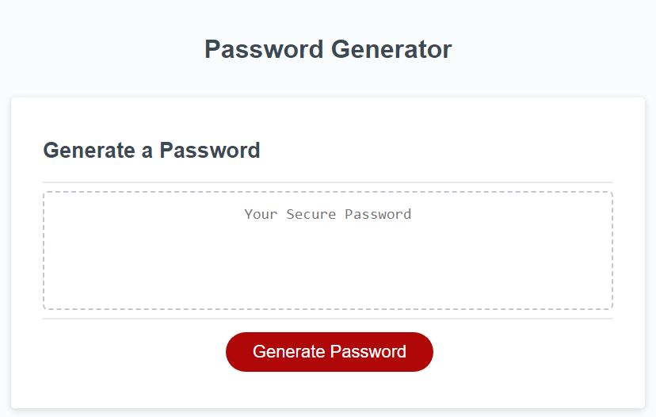
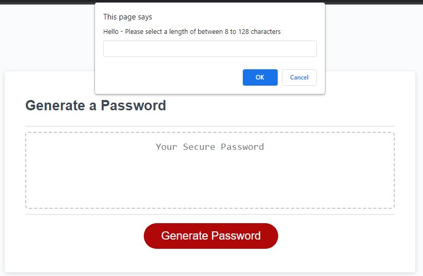

# DT-Password-Generator

This is the password generator where you get to choose from including a variety of different characters like uppercase, lowercase, numerical, and symbols.

In addition, you get to choose the number of characters you want your password to be between 8 to 128 characters.

Once you select "Generate Password", then you will see several popup windows to get the user's feedback.
The first question you would see is getting the user's feedback on the length of the password they prefer.

Please note that I did get the staff support from Brandon Leek, where the coding process utilized may be outside of curriculum content.

Hope you enjoy the Generate Password functionality!
Deployed Link: https://dtrieu1.github.io/DT-Password-Generator/
